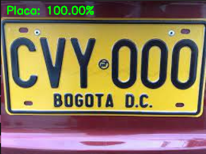

<!--
*** Thanks for checking out the Best-README-Template. If you have a suggestion
*** that would make this better, please fork the repo and create a pull request
*** or simply open an issue with the tag "enhancement".
*** Thanks again! Now go create something AMAZING! :D
-->


<!-- PROJECT SHIELDS -->
<!--
*** I'm using markdown "reference style" links for readability.
*** Reference links are enclosed in brackets [ ] instead of parentheses ( ).
*** See the bottom of this document for the declaration of the reference variables
*** for contributors-url, forks-url, etc. This is an optional, concise syntax you may use.
*** https://www.markdownguide.org/basic-syntax/#reference-style-links
-->


<!-- PROJECT LOGO -->
<br />
<p align="center">
  <a href="https://github.com/topassky/Recocimiento-de-placas-con-deep-learning.git">
    
  </a>

  <h3 align="center">Clasificador de iamgenes con LeNet</h3>

  <p align="center">
    Uso de la red neuronal Lenet para la cladicar placar del contexto colombiano
  <p>

</p>


<!-- TABLE OF CONTENTS -->
<details open="open">
  <summary>Tabla de contenidos</summary>
  <ol>
    <li>
      <a>Ingresar DataSet</a>
    </li>
    <li>
      <a>Ejecución de main.py para el aprendizaje de patrones/a>
    </li>
    <li>
      <a>Ejecución de test_network.py para probar los modelos exportandos en la carpeta output</a>
    </li>

  </ol>
</details>


<!-- ABOUT THE PROJECT -->
## Sobre el proyecto.

Se busca hacer un clasificador de imagenes con la red neuronal LeNet.

### Prerequisitos

Para ejecutar el proyecto debes instalar las siguientes librerias:
* opencv
  ```sh
  pip install opencv-python
  ```
* opencv-contrib-python
  ```sh
  pip install opencv-contrib-python
  ```
* imutils
  ```sh
  pip install imutils
  ```
* tensorflow
  ```sh
  pip install tensorflow
  ```


